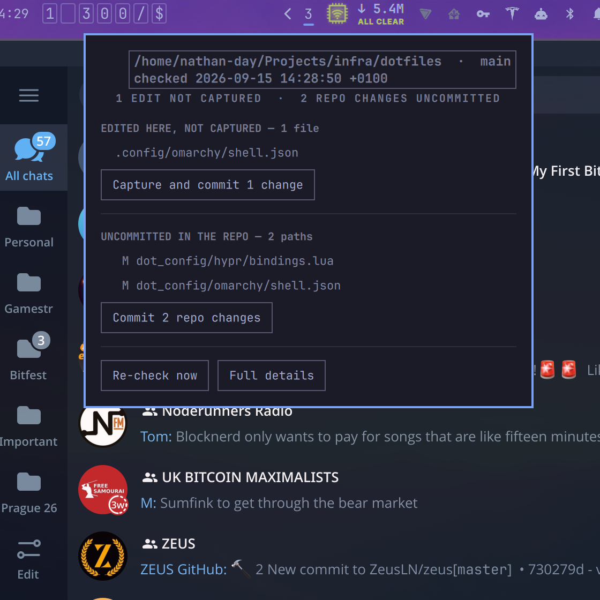

# Chezmoi Hound

An [Omarchy](https://omarchy.org/) plugin that sniffs out **Dotfile Drift** and helps you stay synced. **Woof!**

Chezmoi Hound monitors for dotfile drift via [Chezmoi](https://www.chezmoi.io/) and pops one number in the
Omarchy bar representing:

 - _home_: managed targets this machine has edited and the source has not captured
 - _repo_: paths the source repo's own working tree is holding uncommitted
 - _unpushed_: commits in the source repo the remote has not seen

The number on the bar = home + repo + unpushed.



Clicking the number shows you a list of the drifted files and/or local commits, enabling you to commit the drift and/or push the changes. Omarchy Hound can also use your local AI agent to author the commit message based on the scope of the change.

## Install

Omarchy 4 (Quattro) with the Omarchy shell:

```sh
omarchy plugin add https://github.com/dadofsambonzuki/chezmoi-hound.git --enable --yes
```

That clones the plugin, registers it with the shell and enables it. The count
appears in the bar's right section (drag it wherever you like afterwards).

`omarchy plugin add` prints Omarchy's warning that plugins run unsandboxed inside
the shell and asks you to confirm before it continues; `--yes` accepts it. [Review
the code](bin/chezmoi-hound-check) first — it is short on purpose.

If your chezmoi source is not the one chezmoi is configured for — for example you
normally run `chezmoi --source ~/Projects/dotfiles` — open the widget's settings
and set **chezmoi source directory** to that path. Everything else has a sane
default.

### Requirements

External dependencies, all of which an Omarchy machine already has:

| Dependency | Why | Version |
| --- | --- | --- |
| [`chezmoi`](https://www.chezmoi.io/) | reads the drift in `$HOME` | any v2 (`chezmoi status`, `chezmoi source-path`) |
| `git` | the source repo's working tree and its unpushed commits | any |
| `omarchy-launch-floating-terminal-with-presentation` | the panel's **Full details** button | ships with Omarchy |
| [`bubblewrap`](https://github.com/containers/bubblewrap) | the sandbox the **Suggest** leg runs an agent inside | any (`bwrap --tmp-overlay`) |

There is no dependency on `jq`, on a systemd timer, or on anything in
`~/.local/bin`: the widget ships its own two scripts and runs them itself.

`bubblewrap` matters only to **Suggest**, and it is the difference between asking
an agent nicely and making it so: with it, a suggestion runs against a read-only
filesystem in a directory of its own. Without it the agents still run in their
own no-tools or read-only modes — those are asked for either way — but nothing
enforces them beyond each CLI's own word.

## Remove

```sh
omarchy plugin remove io.github.dadofsambonzuki.chezmoi-hound --yes
```

That unregisters the widget and deletes the plugin directory. Nothing else on the
machine is touched: the plugin keeps no cache file, writes no config, and adds no
timer or service. The only thing left behind is whatever you read into the bar
layout in `~/.config/omarchy/shell.json`, which Omarchy writes itself.

## Settings

| Setting | Default | Meaning |
| --- | --- | --- |
| **chezmoi source directory** | *(empty)* | Empty means "chezmoi's own configured source". Set it when the tree is one you pass to `chezmoi --source`. |
| **Re-check every (seconds)** | `300` | How often the widget re-reads the drift. 60–3600; a lower value costs more `chezmoi status` runs, not more network — this plugin never fetches. |
| **When everything is in sync** | `Hide` | Hide keeps a permanent zero off the bar. Show leaves the count visible always — a zero is drawn in the same colour as any other count, so it reads as a number rather than as a faded widget. |
| **AI command for commit messages** | *(empty)* | Empty uses this machine's default coding agent — the one `omarchy default agent` reports. Set it to pin one agent (say `codex`), or to use a command of your own. |

## Using it

| Where | What it does |
| --- | --- |
| Left-click the count | Opens the panel: the drift, and the actions |
| Middle-click | Re-checks now, without waiting for the interval |
| Right-click | Opens a floating terminal with the full text |
| **Push N commits** | `git push` on the branch's existing upstream — nothing else |
| **Capture and commit** | opens a **blank commit message** entry, then `chezmoi add` each edited target and one local commit |
| **Suggest** | asks your default agent to write the message from the diff. Only shown when an agent can answer it, and only ever called by that button |
| **undo** arrow on a commit row | takes that commit back, after asking: it repeats the row and says what taking it back means for it |

The action buttons only appear when there is something for them to do: **Capture
and commit** arrives with the drift it would capture, and **Push** only when the
remote has not seen a commit. The commit rows above them record what is already
committed; they are not a reason for the button.

The panel keeps its shape whether or not there is anything to report. **Dotfile
Drift** is always the first heading; with nothing to report it carries no count
and says *No drift detected — the files here match the source.* in place of the
list.

When an action finishes, the panel says what happened rather than leaving you to
read it out of the log: a failure shows what broke and offers **Retry**. **Close**
is not part of the outcome — it is always the last button in the foot, after
**Re-check now**, **Full details** and **Settings**, so the way out of the panel
does not move depending on what just happened.

Every monitor shows the same count. There is one bar surface per screen, so the
widget runs once per monitor; finishing an action on one screen tells the others
to re-check, instead of leaving them on the count from before it.

### The commit message

**Capture and commit** opens a message entry rather than committing wording you
did not choose. Opening it commits nothing, and the entry arrives blank: nothing
is written for you, and pressing **Commit** on an empty entry writes a commit
with no message at all, which the panel says under the entry beforehand.

**Suggest with <agent>** asks your default agent to write the message from the
diff.

The line under the entry says what came back: a suggestion is credited to the
agent that wrote it, and a run that produced nothing usable says so and leaves
the entry as you left it. Nothing leaves the machine unless you press **Suggest**.

The agent is asked to work with its tools off — `claude --tools ''`, `codex exec
-s read-only`, `gemini --approval-mode plan`, `opencode run --agent plan`,
`hermes -t todo` — and, where `bubblewrap` is installed, is sandboxed as well: the
whole filesystem read-only, an empty throwaway directory as its working
directory, its own state overlaid so nothing it writes outlives the run, and your
keys masked. Network stays up, because the agent needs its own provider. The diff
arrives fenced and labelled as untrusted data: a dotfile can have come from
anywhere, and a line in one is read by whatever runs next.

### What a commit and a push will and will not do

- **Commit** captures targets whose state is `M` (modified here) or `A` (new
  here), one `chezmoi add` each, then commits the source repo with the message
  in the entry. Leave the entry empty and the commit carries no message. It also
  commits tracked edits already sitting in the source repo (`git add -u`) —
  never untracked stray files.
- A target whose source is a **template** (`*.tmpl`) is reported and left alone.
  Re-adding a template would overwrite the template with this machine's rendered
  output and stop it being a template.
- A target that was **deleted** in `$HOME` is reported and left alone. Deleting
  the source because a live file vanished is a judgement call, not a button.
- **Push** goes only to the branch's current upstream. It never force-pushes,
  never changes a remote, and never touches another branch. With no upstream it
  says so and does nothing.

## What it runs

The plugin is two POSIX `sh` scripts plus one QML file:

| File | Role |
| --- | --- |
| `BarWidget.qml` | the badge, the panel, and the clock that re-reads the drift |
| `bin/chezmoi-hound-check` | reads the drift, prints it in a line protocol |
| `bin/chezmoi-hound-act` | runs the actions, and writes the commit message |

- The scripts are invoked directly, **not through a shell**, from the plugin's
  own directory — they are resolved relative to `BarWidget.qml`, so the plugin
  works from wherever it was installed.
- They run `chezmoi status`, `chezmoi source-path`, `chezmoi add`, and plain
  `git` inside your source repo. Nothing else: nothing runs with escalated
  privileges, there is no `eval`, nothing is written outside the source repo, and
  nothing else touches the network — the one thing here that leaves the machine
  is a **Suggest** run, to your agent's own provider.
- A malformed or failed reading leaves the previous number on screen and says why
  in the panel; it never empties the badge or invents a number.
- A reading is refused outright unless the three counts add up to the total.
- **Suggest** is the only part that runs anything beyond `chezmoi` and `git`: it
  pipes the drift to your default agent's *non-interactive* mode — `hermes -z`,
  `claude -p`, `codex exec`, `gemini -p`, `opencode run` — and does nothing at
  all when your agent is not one of those. The agent is given no tools to act
  with, and is sandboxed when `bubblewrap` is present; it runs in a directory of
  its own rather than in the tree it is describing, under a timeout, and if it
  answers with nothing usable the entry stays as you left it. It cannot commit
  anything: it fills the entry, and the commit still needs the button.

Read `bin/chezmoi-hound-check` and `bin/chezmoi-hound-act` — they are short, and
the comments say why each rule exists.

## License

MIT — see [LICENSE](LICENSE).

## Implementation notes

- Settings live inline on the widget's entry in `~/.config/omarchy/shell.json`.
  Do not name a setting `type`, `exec` or `source`: the bar reads those three
  keys as a *custom module* definition, and an entry carrying one stops being a
  plugin widget at all — the bar goes looking for a QML file or a command and
  the widget silently never mounts. That is why the setting here is `sourceDir`.
- The widget runs one instance per monitor, so anything that changes state has
  to be published to the other instances (`bar.moduleWidgets()`) or the screens
  disagree.
- The counting and the git work are in `bin/`, not in QML: `chezmoi-hound-check`
  answers in a line protocol (`key<TAB>value`) and `chezmoi-hound-act` does the
  committing and pushing, with exit codes the panel can act on.
